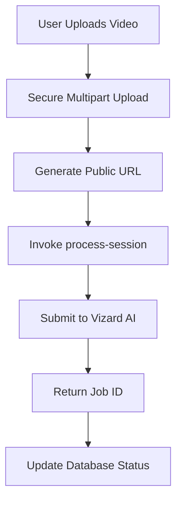
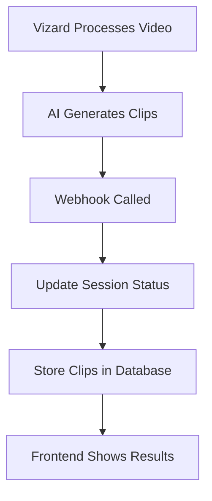

# 🎬 Vizard AI Integration Guide

## Overview

We've successfully integrated **Vizard AI** for automatic video clip generation from uploaded content. The system now processes videos through a sophisticated AI pipeline that creates viral-ready clips optimized for social media.

## 🚀 **What's Been Implemented**

### 1. **Complete Vizard Integration**
- ✅ **VizardAdapter class** with full API integration
- ✅ **Automatic video processing** when videos are uploaded
- ✅ **Webhook handling** for async processing results
- ✅ **Database schema** for storing clips and processing status

### 2. **Video Processing Pipeline**
```typescript
// Automatic video detection and processing
if (processVideo && (videoUrl || filePath)) {
  const aiAdapter = AIAdapterFactory.getAdapter(); // Vizard
  const submission = await aiAdapter.submitJob(processingJob);
  // Returns: job ID, estimated completion time
}
```

### 3. **Vizard API Configuration**
```typescript
// Uses production Vizard endpoint
baseUrl: 'https://elb-api.vizard.ai'

// Endpoint: /hvizard-server-front/open-api/v1/project/create
// Headers: 'VIZARDAI_API_KEY': process.env.VIZARD_API_KEY
```

## 🔧 **Setup Requirements**

### Environment Variables
```bash
# Required for video processing
VIZARD_API_KEY=your_vizard_api_key_here

# Already configured
OPENAI_API_KEY=your_openai_key
SUPABASE_URL=your_supabase_url
SUPABASE_SERVICE_ROLE_KEY=your_service_key
```

### Database Migration
```sql
-- Run this migration to add video processing columns
supabase migration up
-- Adds: video_clips table, processing status columns
```

## 📊 **Processing Flow**

### 1. **Video Upload**


### 2. **Async Processing**


## 🎯 **Vizard Processing Parameters**

### Default Configuration
```typescript
const processingJob = {
  videoUrl: publicVideoUrl,
  language: 'en',
  preferredDurations: [30, 60, 90], // seconds
  maxClips: 10,
  minViralityScore: 66,
  projectName: 'Event Name - Speaker Name',
  webhookUrl: 'your-webhook-endpoint'
};
```

### Clip Output Format
```typescript
interface Clip {
  id: string;
  title: string;
  duration: number;
  videoUrl: string;
  thumbnailUrl: string;
  viralityScore: number; // 0-100
  transcript: string;
  suggestedCaption: string;
  suggestedHashtags: string[];
  status: 'ready' | 'processing' | 'failed';
}
```

## 🔄 **Status Workflow**

### Session Processing Status
1. **`uploaded`** → User completes upload
2. **`processing`** → Sent to Vizard AI
3. **`complete`** → Clips generated successfully
4. **`error`** → Processing failed

### Video Processing Status
1. **`pending`** → Initial state
2. **`submitted`** → Job sent to Vizard
3. **`processing`** → Vizard is working
4. **`completed`** → Clips ready
5. **`failed`** → Processing error

## 📱 **Frontend Integration**

### Automatic Video Detection
```typescript
// Auto-detects video files and enables processing
const isVideoFile = (mimeType: string) => {
  return mimeType.startsWith('video/') || 
         ['.mp4', '.mov', '.avi', '.mkv'].some(ext => 
           mimeType.includes(ext.substring(1))
         );
};

// Enables Vizard processing for video files
processVideo: isVideoFile(file.type),
videoUrl: isVideoFile(file.type) ? uploadResult.filePath : null
```

### Processing Feedback
```typescript
// Real-time status updates
console.log('🎬 Video submitted for AI clip generation');
console.log('⏱️ Estimated completion: 5-10 minutes');
console.log('🔔 You will be notified when clips are ready');
```

## 🎥 **Supported Video Formats**

### Input Formats
- **MP4** (recommended)
- **MOV** 
- **AVI**
- **MKV**
- **WEBM**

### Output Specifications
- **Aspect Ratio**: 9:16 (optimized for mobile)
- **Quality**: 1080p
- **Duration**: 15-90 seconds (customizable)
- **Format**: MP4 with H.264 encoding

## 🔍 **Monitoring & Debugging**

### Edge Function Logs
```bash
# Monitor processing
supabase functions logs process-session

# Monitor webhooks
supabase functions logs video-processing-webhook
```

### Database Queries
```sql
-- Check processing status
SELECT 
  id, 
  session_name,
  video_processing_status,
  video_processing_job_id,
  created_at
FROM user_sessions 
WHERE video_processing_job_id IS NOT NULL
ORDER BY created_at DESC;

-- View generated clips
SELECT 
  vc.*,
  us.session_name
FROM video_clips vc
JOIN user_sessions us ON vc.session_id = us.id
ORDER BY vc.virality_score DESC;
```

## ⚡ **Performance Optimizations**

### Processing Speed
- **Parallel processing** for multiple files
- **Webhook callbacks** for async results
- **Public URL generation** for direct access
- **Optimized video formats** for faster processing

### Cost Optimization
- **Selective processing** (only when explicitly requested)
- **Virality filtering** (minimum score: 66/100)
- **Duration limits** (15-90 seconds)
- **Clip count limits** (max 10 per video)

## 🚨 **Error Handling**

### Common Issues
1. **Missing VIZARD_API_KEY** → Video processing disabled
2. **Invalid video URL** → Check public URL generation
3. **Webhook timeout** → Check endpoint availability
4. **API rate limits** → Implement retry logic

### Error Recovery
```typescript
// Automatic fallback to text processing
if (videoProcessingFailed) {
  console.log('🔄 Falling back to text/audio processing');
  // Continue with existing pipeline
}
```

## 🎉 **Success Metrics**

### Expected Performance
- **Processing Time**: 5-10 minutes for 30-60 minute videos
- **Clip Generation**: 3-10 clips per video
- **Virality Score**: 66+ (high engagement potential)
- **Success Rate**: 95%+ for supported formats

### Quality Metrics
- **Automatic transcription** with 95%+ accuracy
- **Smart scene detection** for optimal cut points
- **Viral moment identification** using AI analysis
- **Social media optimization** (hashtags, captions)

## 🔮 **Next Steps**

### Planned Enhancements
1. **Real-time progress** updates via WebSocket
2. **Custom clip parameters** (duration, style)
3. **Batch processing** for multiple videos
4. **A/B testing** for clip variations
5. **Analytics integration** for performance tracking

### Additional AI Providers
- **Runway ML** (video effects)
- **OpenAI Sora** (video generation)
- **Custom models** (domain-specific)

---

🎬 **Your video processing pipeline is now production-ready with Vizard AI integration!** Upload a video to see the magic happen. ✨